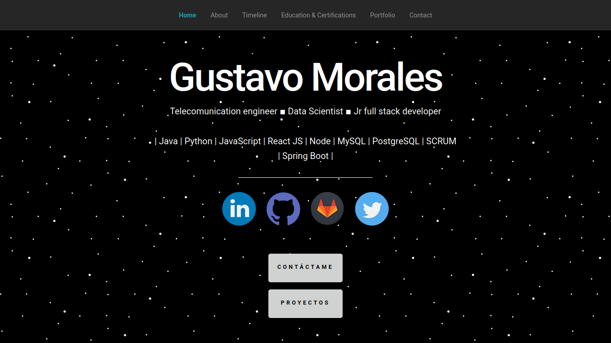

# Portafolio digital Creado con React

Este portfolio digital desarrollado en React.js fue creado a partir del la guía de Daniel Briceño
https://github.com/dbriceno10

## Comenzando 🚀

Para hacerlo funcionar, te invito a clonar o forkear el repo. Una vez descargado, abre la terminal de comandos y ubicate en la carpeta del proyecto.

## Scripts Disponibles📌

En el directorio del proyecto puedes ejecutar:

### `npm i ó npm install`
Para instalar todas las dependencias que requiere el proyecto para funcionar.

### `npm start`

Corre la aplicación en modo desarrollo un tu servidor local en tu computadora.
Abre [http://localhost:3000](http://localhost:3000) para verlo en el navegador.

### `npm run build`

Una vez realizado todos los cambios deseados con este comando crearas un bundle optimizado del proyecto listo para desplegar a producción.

### `npm run deploy`

El proyecto tiene una pequeña comfiguración para hacer el despliegue del proyecto en gh-pages en modo producción. Si usted desea modificar el proyecto para desplegar su propia app, debe cambiar en el archivo package.json la propiedad "homepage", de la siguiente manera: "homepage": "https://nombre-usuario.github.io/nombre-repositorio"

## Despliegue 📦

Podrás visitar mi portafolio en el siguiente enlace: https://gmmorales.github.io/portfolio

## Construido con 🛠️

HTML, CSS, JavaScript, React.

El formulario de contacto se conecta a un api externa para guardar los datos en una base de datos, desarrollada con Node, Express y MongoDB.

---
Gustavo M. Morales
